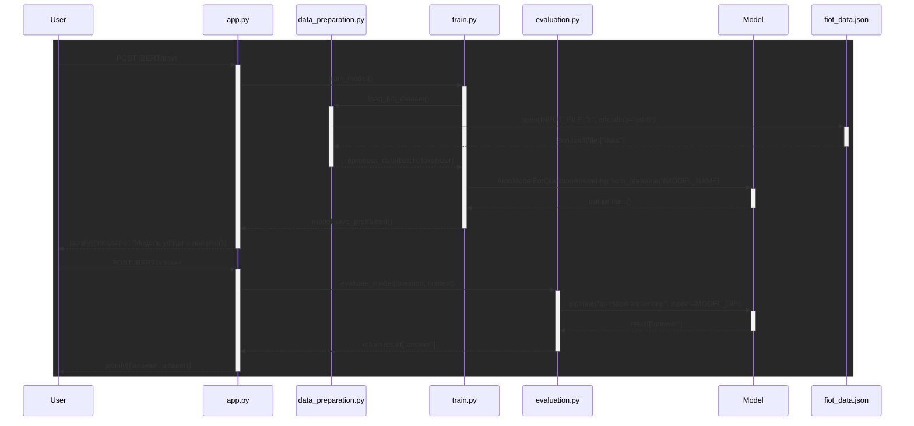

```mermaid
sequenceDiagram
    participant User
    participant app.py
    participant data_preparation.py
    participant train.py
    participant evaluation.py
    participant Model
    participant fiot_data.json

    rect rgb(40, 40, 40)
    User->>+app.py: POST /BERT/train
    app.py->>+train.py: train_model()
    train.py->>+data_preparation.py: load_full_dataset()
    data_preparation.py->>+fiot_data.json: open(INPUT_FILE, "r", encoding="utf-8")
    fiot_data.json-->>-data_preparation.py: json.load(file)["data"]
    data_preparation.py-->>-train.py: preprocess_data(batch, tokenizer)
    train.py->>+Model: AutoModelForQuestionAnswering.from_pretrained(MODEL_NAME)
    Model-->>-train.py: trainer.train()
    train.py-->>-app.py: model.save_pretrained()
    app.py-->>-User: jsonify({'message': 'Модель успішно навчена'})

    User->>+app.py: POST /BERT/answer
    app.py->>+evaluation.py: evaluate_model(question, context)
    evaluation.py->>+Model: pipeline("question-answering", model=MODEL_DIR)
    Model-->>-evaluation.py: result["answer"]
    evaluation.py-->>-app.py: return result["answer"]
    app.py-->>-User: jsonify({'answer': answer})
    end
```