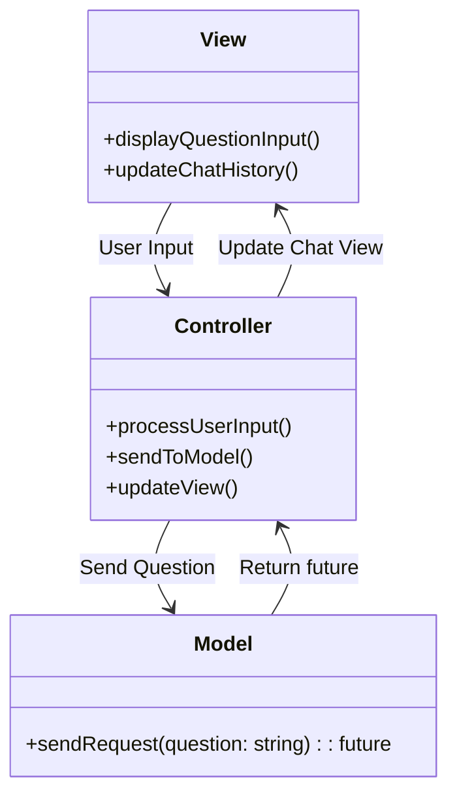

```mermaid
%% Component Diagram (Application Components)
classDiagram
    class View {
        +displayQuestionInput()
        +updateChatHistory()
    }

    class Controller {
        +processUserInput()
        +sendToModel()
        +updateView()
    }

    class Model {
        +sendRequest(question: string): future<string>
    }

    View --> Controller : User Input
    Controller --> Model : Send Question
    Model --> Controller : Return future<string>
    Controller --> View : Update Chat View
```