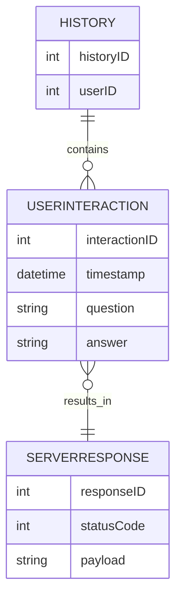

```mermaid
%% ER Diagram (Data and Relationships)
erDiagram
    HISTORY {
        int historyID
        int userID
    }

    USERINTERACTION {
        int interactionID
        datetime timestamp
        string question
        string answer
    }

    SERVERRESPONSE {
        int responseID
        int statusCode
        string payload
    }

    HISTORY ||--o{ USERINTERACTION : contains
    USERINTERACTION }o--|| SERVERRESPONSE : results_in
```