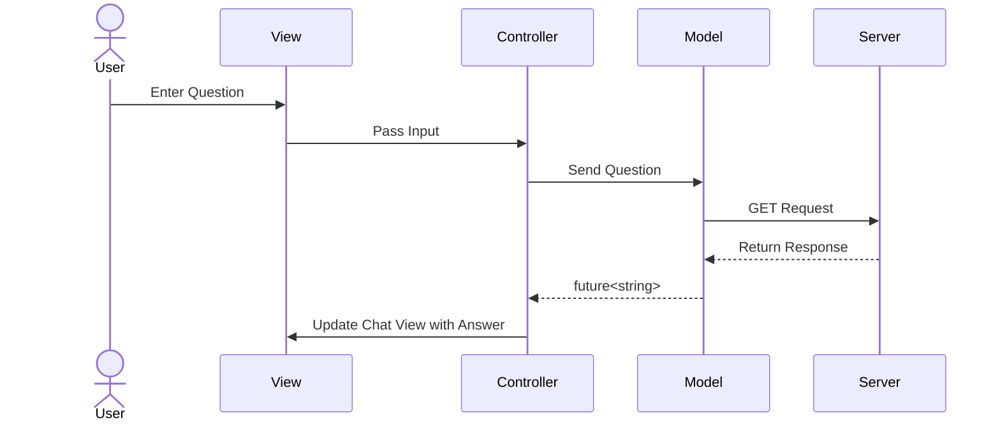

```mermaid
%% Sequence Diagram (Data Update Scenario)
sequenceDiagram
    actor User
    participant View
    participant Controller
    participant Model
    participant Server

    User ->> View: Enter Question
    View ->> Controller: Pass Input
    Controller ->> Model: Send Question
    Model ->> Server: GET Request
    Server -->> Model: Return Response
    Model -->> Controller: future<string>
    Controller ->> View: Update Chat View with Answer
```