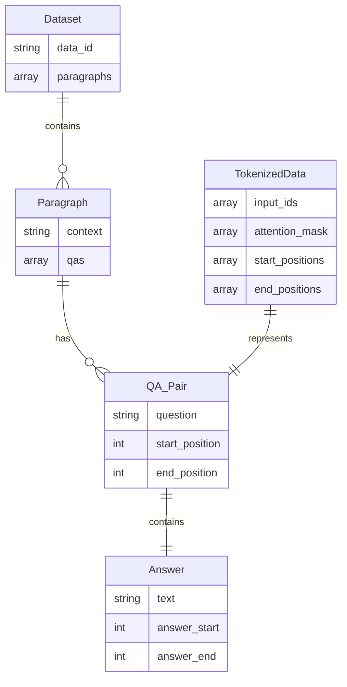

```mermaid
erDiagram
    Dataset ||--o{ Paragraph : contains
    Paragraph ||--o{ QA_Pair : has
    QA_Pair ||--|| Answer : contains
    TokenizedData ||--|| QA_Pair : represents

    Dataset {
        string data_id
        array paragraphs
    }
    
    Paragraph {
        string context
        array qas
    }
    
    QA_Pair {
        string question
        int start_position
        int end_position
    }
    
    Answer {
        string text
        int answer_start
        int answer_end
    }
    
    TokenizedData {
        array input_ids
        array attention_mask
        array start_positions
        array end_positions
    }
```