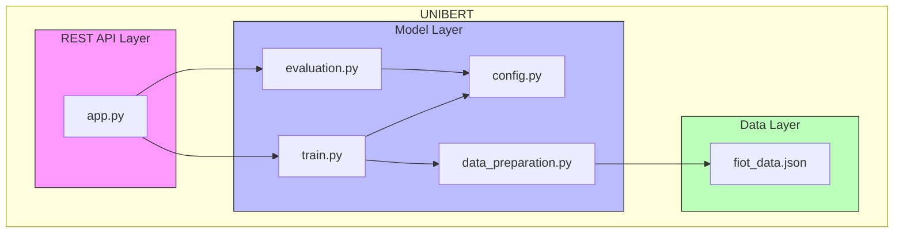

```mermaid
graph TD
    subgraph UNIBERT
        subgraph API[REST API Layer]
            A[app.py]
        end

        subgraph ModelLayer[Model Layer]
            B[config.py]
            C[data_preparation.py]
            D[evaluation.py]
            E[train.py]
        end

        subgraph DataLayer[Data Layer]
            G[fiot_data.json]
        end

        A --> D
        A --> E
        C --> G
        D --> B
        E --> B
        E --> C
    end

    style API fill:#f9f,stroke:#333
    style ModelLayer fill:#bbf,stroke:#333
    style DataLayer fill:#bfb,stroke:#333
```